# chip8stm32

chip8stm32 is a handheld computer based on a STM32 microcontroller. It includes all the peripherals needed to play CHIP-8 and Super-CHIP games on the go: a hexadecimal keypad, a 128x64 OLED display and a passive buzzer. It can run the [chip8swemu](https://github.com/AlfonsoJLuna/chip8swemu) software for emulation.

See it in action: https://www.youtube.com/watch?v=vA76s3j4H90

    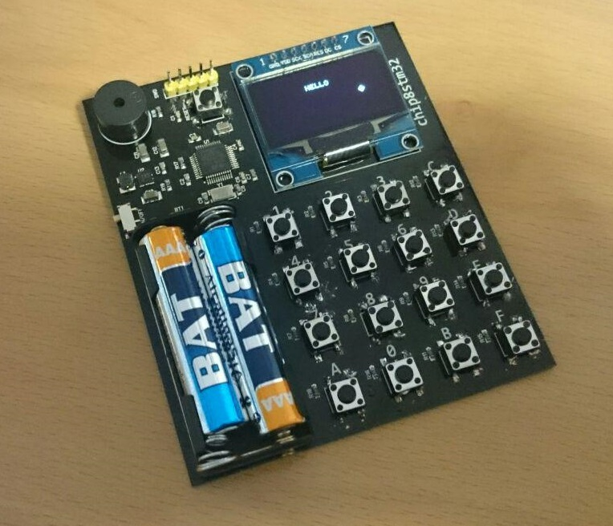

## Image gallery

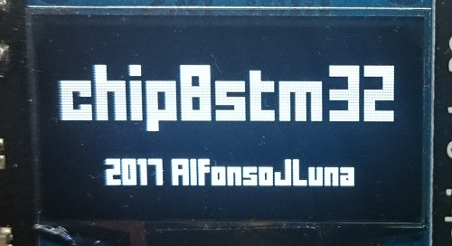 | 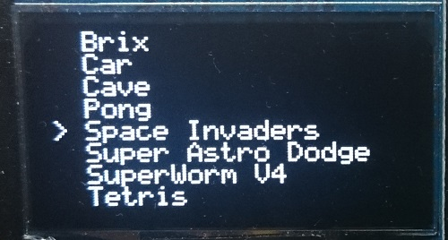 | 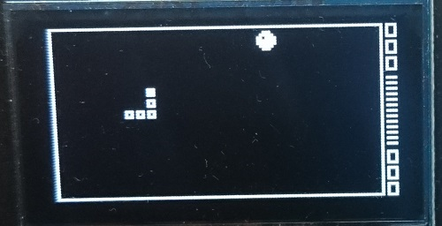
:-----------: | :-------------: | :-------------:
Splash screen | Menu | SuperWorm V4
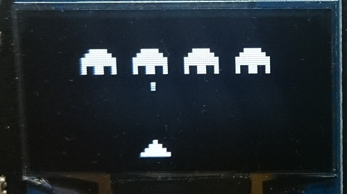 | 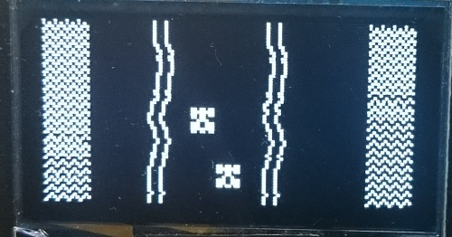 | 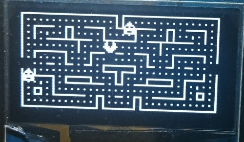
Space Invaders | Car | Blinky
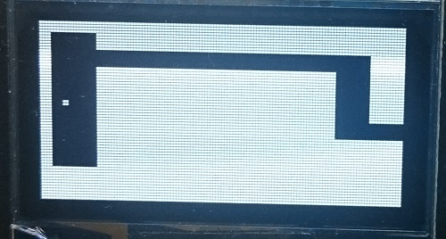 | 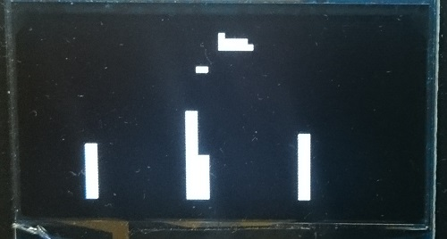 | 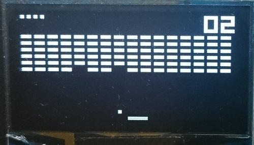
Cave | Blitz | Brix
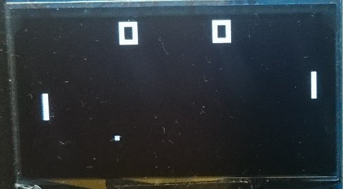 | 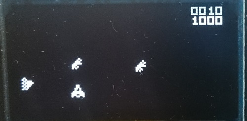 | 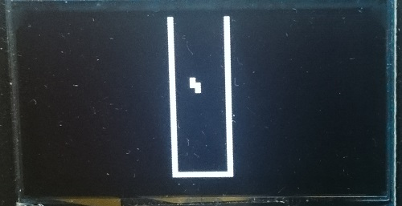
Pong | Super Astro Dodge | Tetris
